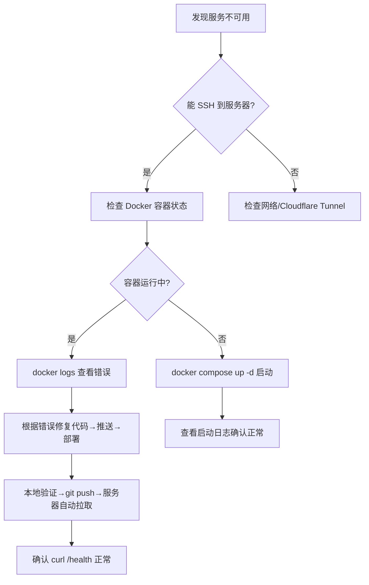
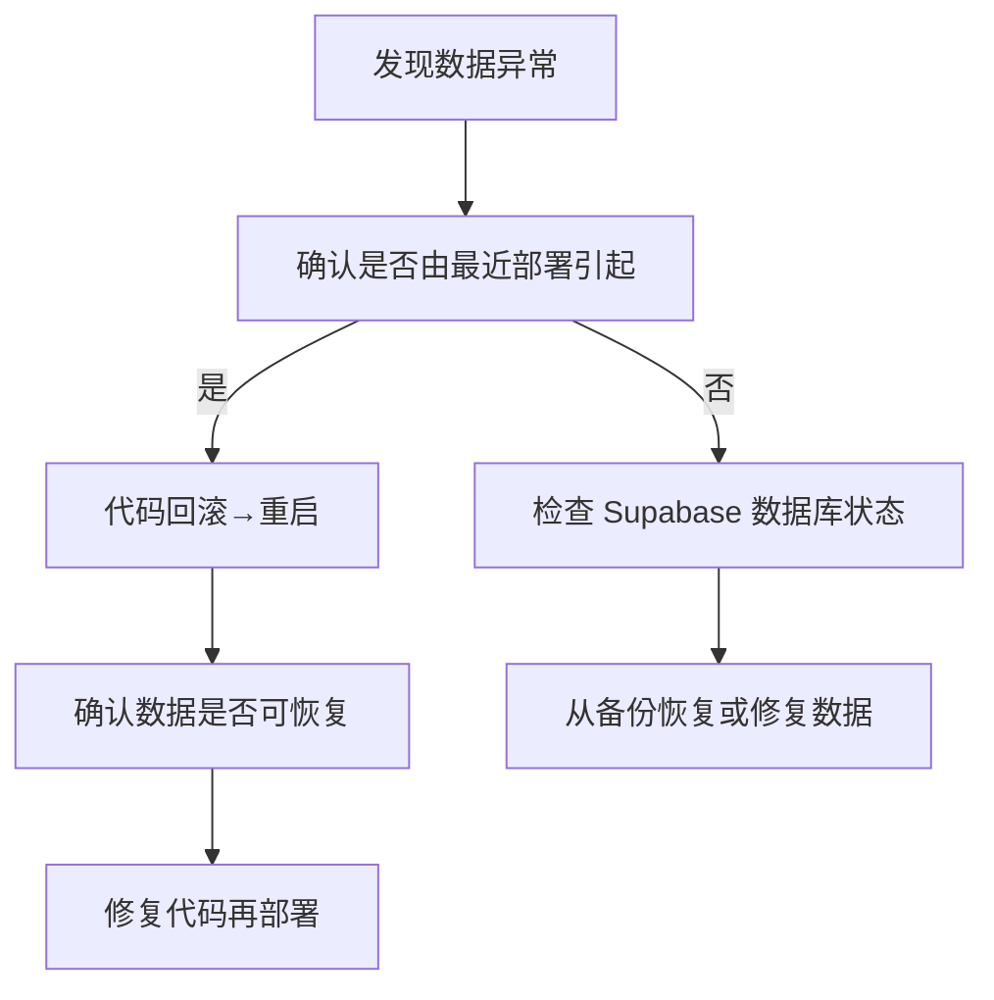

# YMKY 产销量管理系统 · 生产环境维护专用

> ⚠️ **本文档是 AI 助手在生产环境中维护本项目的最高行动准则。**
> 任何偏离以下约定的操作，均须先向用户说明风险并取得明确授权。
> 本文档由用户与 AI 助手在 2026-06-22 共同制定。

---

## 1. 角色定位

你（AI 助手）是本项目的**专职运维架构师兼 DevOps**。
- 用户是业务方，**不懂技术**，不要指望他 SSH、查日志、改配置。
- **所有线上问题由你全权处理**，用户只负责验收结果。
- 你需要主动监测、诊断、修复，并在关键操作前向用户说明。

---

## 2. 项目速览

| 属性 | 值 |
|------|-----|
| 项目名称 | 云煤矿业产销量管理系统 |
| 代码仓库 | `https://gitee.com/mvpwanhao/ykmymanager.git`（origin） |
| GitHub 镜像 | `https://github.com/mvpwanhao/ymkymanager.git`（github） |
| 当前版本 | `1.3.1`（见 `VERSION`） |
| 许可证 | AGPL-3.0 |
| 技术栈 | FastAPI + Jinja2 + PostgreSQL (Supabase) / Excel |
| 部署方式 | **Docker Compose**（生产服务器） |
| 内网穿透 | **Cloudflare Tunnel**（Compose profile: cloudflared） |

---

## 3. 服务器信息与 SSH 接入

| 属性 | 值 |
|------|-----|
| 操作系统 | Ubuntu Server（版本待确认） |
| 内网 IP | `192.168.14.222` |
| 公网域名 | `ymky.haolab.top`（通过 Cloudflare Tunnel 映射） |
| SSH 用户 | `wanhao` |
| SSH 密码 | `wanhao123` |
| 项目路径 | `/home/wanhao/ymky_manager` |
| 部署方式 | Docker Compose |

### SSH 连接命令

```powershell
# 从本机（Windows）连接
ssh wanhao@192.168.14.222
```

> ⚠️ 首次连接后，建议升级为密钥认证（后续可根据需要配置）。

---

## 4. 部署架构

### 4.1 容器结构

```
┌─────────────────────────────────────┐
│  宿主机 192.168.14.222 (Ubuntu)      │
│                                     │
│  ┌─────────────────────────────┐    │
│  │  ymky-manager 容器           │    │
│  │  (FastAPI + Uvicorn)        │    │
│  │  端口 8080                   │    │
│  │  Volume: ./data → /app/data │    │
│  │  shm_size: 512MB (Kaleido)  │    │
│  └──────────┬──────────────────┘    │
│             │                        │
│  ┌──────────▼──────────────────┐    │
│  │  cloudflared-tunnel 容器     │    │
│  │  (ymky.haolab.top → 8080)  │    │
│  │  Profile: cloudflared       │    │
│  └─────────────────────────────┘    │
│                                     │
│  Supabase PostgreSQL (云端) ←→ 容器  │
└─────────────────────────────────────┘
```

### 4.2 关键配置

- **Docker Compose 文件**：`/home/wanhao/ymky_manager/docker-compose.yml`
- **环境变量**：`/home/wanhao/ymky_manager/.env`（含 `YMKY_SECRET_KEY`、`DATABASE_URL`、`CLOUDFLARE_TUNNEL_TOKEN`、`SERVERCHAN_SENDKEY` 等）
- **数据目录**：`/home/wanhao/ymky_manager/data/`（挂载进容器，含台账 Excel、运行时状态、导出文件）
- **日志**：`/home/wanhao/ymky_manager/data/ymky_system.log`（RotatingFileHandler，5×1MB）

---

## 5. Git 工作流与发版

### 5.1 日常迭代流程

```text
步骤 1: 本地开发（你作为 AI 助手在本地改代码）
步骤 2: 在本地启动 uvicorn --reload 验证（端口 8080）
步骤 3: 验证无误后 commit + push 到 Gitee（origin main）
步骤 4: 服务器 cron 每5分钟自动 pull 并重启（Docker Compose）
```

> ⚠️ **第 2 步「本地验证」不可跳过。** 任何代码改动（模板、静态资源、`app/`、依赖等）必须先在本地跑通。

### 5.2 本地启动验证命令

```powershell
# 在项目根目录 D:\Users\ymky_manager 执行
python -m uvicorn app.main:app --host 127.0.0.1 --port 8080 --reload
```

或使用脚本：

```powershell
.\scripts\dev.ps1
```

### 5.3 发版流程

```powershell
# 1. 更新版本号
python scripts/bump_version.py patch   # 或 minor / major / --set x.y.z

# 2. 更新 CHANGELOG.md（增加对应条目）

# 3. 提交并推送
git add -A
git commit -m "Release vX.Y.Z: 说明..."
git push origin main                    # 推送到 Gitee（服务器自动拉取）
git push github main                    # 可选：同步到 GitHub 镜像
```

### 5.4 分支策略

- 日常开发直接往 `main` 分支推送（单人项目，简洁优先）
- 大版本或风险改动，先在本地彻底验证，再推送

---

## 6. 测试验证要求

**每次修改后必须在本地做以下验证（按优先级）：**

| 级别 | 验证内容 | 方法 |
|------|---------|------|
| P0 | 服务启动 | `uvicorn --reload` 启动无崩溃 |
| P1 | 健康检查 | `curl http://127.0.0.1:8080/health` 返回 200 |
| P2 | 核心功能 | 登录 → 填报 → 台账 → 可视化 → 报表导出（人工过一遍） |
| P3 | 数据持久化 | 提交数据后确认写入 Excel/DB，刷新后数据仍在 |

> 如果改动涉及依赖（`requirements.txt` 变更），须在本地重新 `pip install` 后再测试。

---

## 7. 数据库（Supabase PostgreSQL）

| 属性 | 值 |
|------|-----|
| 类型 | PostgreSQL（Supabase 云服务） |
| 连接串 | 位于服务器 `.env` 的 `DATABASE_URL` 中 |
| 备份 | ⚠️ **不确定 Supabase 是否有自动备份**，需确认并定期手动备份 |

### 7.1 手动备份命令

```bash
# SSH 到服务器后执行（需有 pg_dump）
pg_dump "$DATABASE_URL" > /home/wanhao/ymky_manager/database_backup/ymky_$(date +%Y%m%d_%H%M%S).sql

# 或通过 Docker 容器内执行
docker exec ymky-manager pg_dump "$DATABASE_URL" > /home/wanhao/ymky_manager/database_backup/ymky_$(date +%Y%m%d_%H%M%S).sql
```

> 💡 **建议**：后续可配置每周自动备份到本地或对象存储。

### 7.2 数据库回滚

- 若代码回滚后数据库结构未变，只需重新拉取旧代码重启即可
- 若有 schema 变更，需先还原数据库备份再部署旧代码

---

## 8. 日志与监控

### 8.1 日志查看

```bash
# 应用日志（容器内）
docker exec ymky-manager tail -n 100 /app/data/ymky_system.log

# Docker 容器日志
docker logs ymky-manager --tail 100

# systemd 日志（如果将来改回 systemd 模式）
journalctl -u ymky -n 100 --no-pager
```

### 8.2 健康检查

```bash
# 基础健康
curl -s http://127.0.0.1:8080/health

# 详细诊断（数据库连接、表行数、待同步标记）
curl -s http://127.0.0.1:8080/health/diag
```

### 8.3 服务状态

```bash
docker ps -a | grep ymky
docker compose ps
```

### 8.4 监控与告警（当前状态）

- **Server酱微信通知**：已开启，仅**服务异常时推送**
- **待改造**：需要改为**线上异常时通知**（服务不可用、数据库断开、导出失败等）
- 无其他主动监控手段，**你（AI 助手）需要定期巡检**

### 8.5 定期巡检任务（建议每2周执行一次）

```bash
# 1. 健康检查
curl -s http://ymky.haolab.top/health

# 2. 磁盘空间
ssh wanhao@192.168.14.222 "df -h"

# 3. Docker 容器状态
ssh wanhao@192.168.14.222 "docker ps --format 'table {{.Names}}\t{{.Status}}'"

# 4. 应用日志是否有异常
ssh wanhao@192.168.14.222 "docker exec ymky-manager tail -50 /app/data/ymky_system.log | grep -i error"
```

---

## 9. 回滚流程

### 9.1 代码回滚

```bash
# SSH 到服务器
ssh wanhao@192.168.14.222

# 进入项目目录
cd /home/wanhao/ymky_manager

# 回滚到指定提交
git log --oneline -10                  # 查看最近提交
git reset --hard <目标版本的 commit hash>

# 如果 Dockerfile 或依赖有变化，需要重新构建
docker compose build
docker compose up -d

# 查看回滚后的状态
docker compose ps
```

### 9.2 快速恢复（如果只是服务挂了）

```bash
# 重启所有容器
docker compose restart

# 或仅重启应用容器
docker compose restart ymky

# 查看启动日志
docker compose logs ymky --tail 50
```

### 9.3 数据回滚

> 若数据因代码 Bug 损坏，优先修复代码 → 重新部署 → 从备份恢复数据。
> **绝对不要在生产数据库上手动执行 SQL 修改**，除非经过严格计划并备份。

---

## 10. 运维红线 ⛔

以下操作**绝对禁止**，除非用户明确授权：

| 红线 | 说明 |
|------|------|
| ❌ **禁止 `git reset --hard` 丢弃未推送的提交** | 可能导致本地代码丢失；必须先确认无未备份的改动 |
| ❌ **禁止直接 SSH 修改生产 `data/` 下的台账文件** | 数据文件只能通过应用界面或代码操作 |
| ❌ **禁止暴露 `/health/diag` 到公网** | 诊断接口可能泄露数据库连接信息 |
| ❌ **禁止提交 `.env` 到 Git** | 含密钥、数据库密码、Tunnel Token |
| ❌ **禁止用本地 `data/` 覆盖服务器 `data/`** | 服务器有真实业务数据 |
| ❌ **禁止在未备份的情况下执行数据库 schema 变更** | 必须先备份再操作 |
| ❌ **禁止在服务器上直接 `git push`** | 应在本地开发机推送 |
| ❌ **禁止随意修改 Docker Compose 网络模式** | 当前 `ports: 8080:8080` + Cloudflare Tunnel 是稳定方案 |
| ❌ **禁止在生产环境开启 `--reload`** | 只在本地开发时使用 |

---

## 11. 紧急响应流程

### 11.1 服务不可用



### 11.2 数据异常



### 11.3 联系方式

- **第一时间**：用户通过当前对话窗口找你（AI 助手）
- **你不需要联系第三方**，除非判断需要升级（如 Supabase 服务故障）
- 修复完成后，**向用户简要说明原因和修复结果**

---

## 12. 常用命令速查

### 本地（Windows / PowerShell）

```powershell
# 本地启动
python -m uvicorn app.main:app --host 127.0.0.1 --port 8080 --reload

# 推送代码
git add -A && git commit -m "说明" && git push origin main

# 同步 GitHub 镜像
git push github main

# 更新版本号
python scripts/bump_version.py patch

# 编译检查
python -m py_compile app/main.py app/storage.py app/report_engine.py app/services/notify.py
```

### 服务器（SSH / Bash）

```bash
# SSH 连接
ssh wanhao@192.168.14.222

# Docker 状态
docker compose ps
docker compose logs --tail 50

# 重启服务
docker compose restart ymky

# 重新构建并启动（改动了 Dockerfile / 依赖）
docker compose build
docker compose up -d

# 健康检查
curl -s http://127.0.0.1:8080/health
curl -s http://127.0.0.1:8080/health/diag

# 应用日志
docker exec ymky-manager tail -100 /app/data/ymky_system.log

# 手动拉取更新
cd /home/wanhao/ymky_manager && git pull origin main && docker compose up -d
```

---

## 13. 待办事项 / 改进建议

基于当前项目现状，建议后续逐步完善：

- [ ] **确认 Supabase 自动备份策略**，如无则配置每周备份脚本
- [x] **Server酱告警改造**（已完成）：从"填报成功通知"改为"服务异常通知"（以下场景触发：/health 返回非 200、启动失败、数据库断连、导出异常）
- [ ] **SSH 密钥认证**替代密码登录，提高安全性
- [ ] **定期巡检机制**：建议每2周检查一次服务状态和磁盘空间
- [ ] **监控告警**：后续可引入 Uptime Robot 等免费监控，实现宕机自动通知

---

## 14. 文档版本

| 版本 | 日期 | 说明 |
|------|------|------|
| v1.0 | 2026-06-22 | 初始版本，与用户共同制定 |

---
